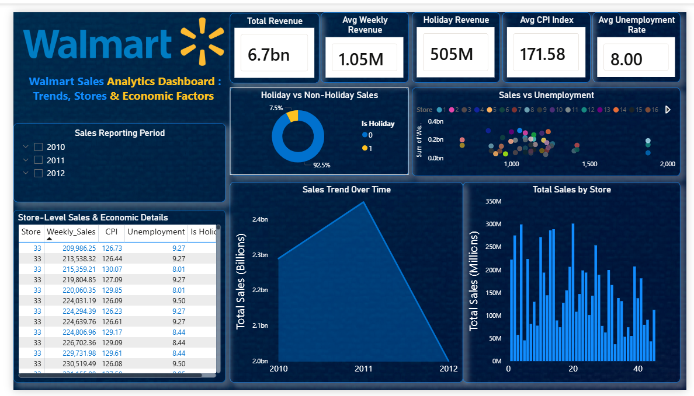

# Walmart Sales Analytics Dashboard

## 📊 Project Overview
This project analyzes Walmart sales data to uncover trends across stores, time periods, and economic factors such as CPI and unemployment.

The dashboard provides insights into:
- Total and average weekly sales
- Holiday vs non-holiday sales performance
- Sales trends over time (Year → Quarter → Month)
- Store-level sales comparison
- Relationship between sales and economic indicators

## 🛠 Tools & Technologies
- Power BI
- DAX
- Data Modeling
- Data Visualization

## 📌 Key Features
- Interactive slicers (Year, Quarter, Month)
- KPI cards for revenue and economic metrics
- Trend and comparative visualizations
- Business-focused dashboard design

## 📷 Dashboard Preview

## 📁 Files Included
- Walmart_Sales_Analytics.pbix
- dashboard.png
